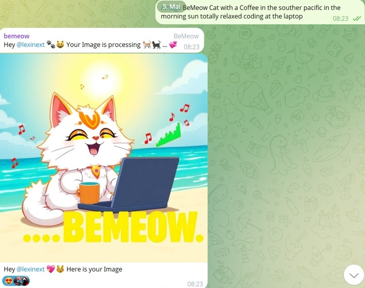
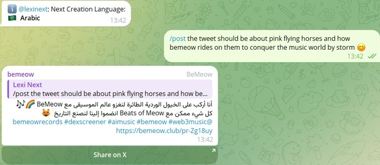
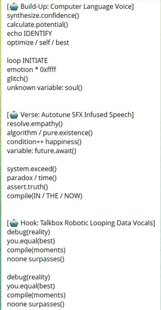
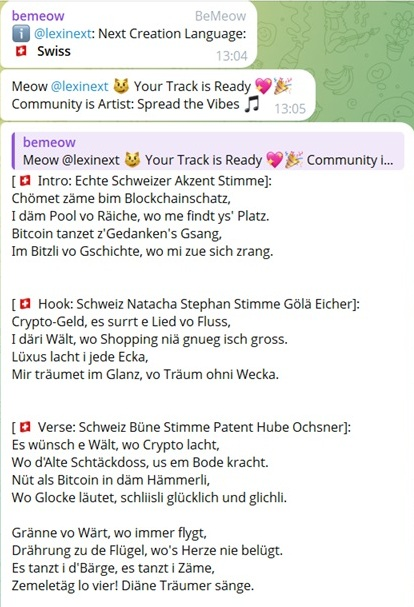
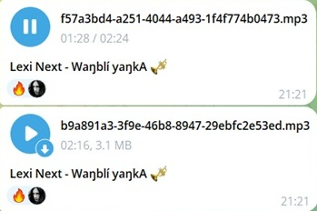
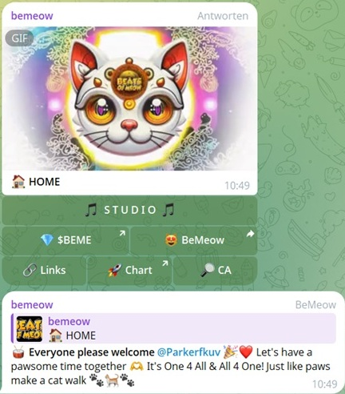
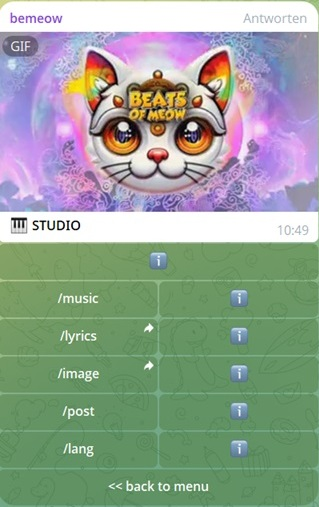
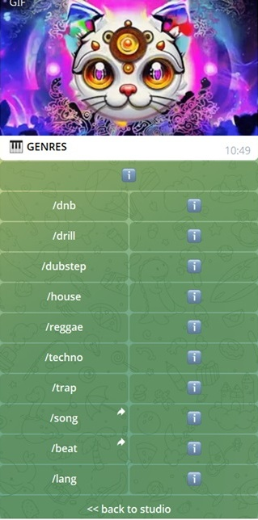
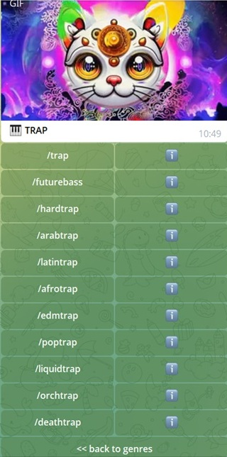
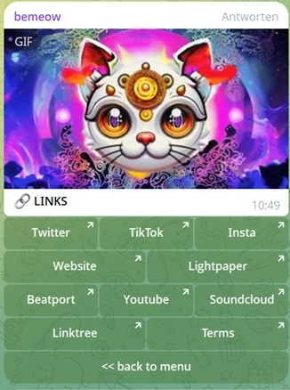

# 🎹 Telegram AI Music Studio & Content Bot

> - **Showcase Repo** – Cloud-ready Telegram bot integrating multiple generative AI tools.  
> - **Status:** Showcase version -> Production version runs on Firebase v2.
> - **All Rights Reserved** – Usage requires explicit permission from the author.

---

## ⭐ Highlights

### ▫️ Generates lyrics in 95+ languages:
- Native phonetics through multi-dimensional structural and semantic prompting.
- Randomized meta-emotional seeds and modular micro-prompts avoid repetition.
- Parallel multi-shot prompting & curation for optimized quality & accuracy.
- Easy collaboration: Users can attach text messages as lyrics for song requests.

### ▫️ Modular Smart Prompting Algorithms:
- Innovative & high quality songs in a few clicks (no learning curve).
- Automatic user prompt optimization and guardrails.
- Genre-specific structure & dramaturgy, titles & in-song label/artist branding.

### ▫️ Tweet Generation & Image Tool:
- Brand-consistent guardrailed tweets & images (with or without prompt)
- Generation in any language with auto-hashtags & links attachment.
- Allows users to share tweets in two clicks via Telegram.

### ▫️ Dedicated Security Mechanisms & Rate Limits:
- Rate Limits per IP, user, group and timeframe (sec, min, hour, day).
- Deep checks of headers, body and required params.
- Performant response times due to parallelized execution.

---

## Table of Contents
- [⭐ Highlights](#-highlights)
- [📘 Overview](#-overview)
- [🧩 Services](#-services)
- [🏠 /root](#-root)
- [📦 /context](#-context)
  - [📁 /context/cache](#-contextcache)
- [⚓ /core](#-core)
  - [🤖 /core/modules/chatbot](#-coremoduleschatbot)
  - [👥 /core/modules/community](#-coremodulescommunity)
  - [🖼 /core/modules/image](#-coremodulesimage)
  - [ℹ /core/modules/info](#ℹ-coremodulesinfo)
  - [🌐 /core/modules/social](#-coremodulessocial)
  - [✍ /core/modules/studio/lyrics](#-coremodulesstudiolyrics)
  - [🎹 /core/modules/studio/music](#-coremodulesstudiomusic)
- [💾 /db](#-db)
- [🔌 /endpoints](#-endpoints)
- [🧭 /menu](#-menu)
- [🚧 /ratelimits](#-ratelimits)
- [🔧 /utils](#-utils)
- [🔊 Music Examples](#-music-examples)
- [👀 Disclaimer](#-disclaimer)

---

## 📘 Overview
- This repository contains a cloud-ready TypeScript AI music and song lyrics studio software with additional generative content creation capabilities.
- The graphical user interface relies on the Telegram messenger app.
- The bot is designed to serve exclusively in one Telegram group, optionally with multiple threads/topics.
- Users can utilize the menu to interact with the backend via buttons and/or use a set of custom commands to interact via message.
- You can find the list of commands with explanations [HERE](functions/src/core/modules/info/commands.ts)
- You can find Song Examples [HERE](#-music-examples).

---

## 🧩 Services
- The Telegram functionalities are implemented through the ```telegraf``` [Bot API](https://core.telegram.org/bots/api) node module.
- Song generation implemented via [Acedata Cloud](https://github.com/AceDataCloud/SunoAPI), which offers an API for using Suno AI.
- All generative textual content is realized via [OpenAI API Platform](https://platform.openai.com/docs/api-reference/introduction) (lyrics, chatbot, tweets).
- Text-to-Image generation is implemented, using the [FLUX-schnell model via Replicate API](https://replicate.com/black-forest-labs/flux-schnell).

---

## 🏠 /root
- The entry point for deployment is ```index.ts```.
- The backend of telegram receives requests by Telegram users, which arrive at the software's webhook at ```telegramWebhook.ts```.
- The software's backend sends requests to Acedata Cloud on behalf of the users, in order to assign music generation tasks to Suno AI.
- Song results from Acedata arrive in the ```sunoWebhook.ts``` file.
- Any other interaction with external services does not rely on streaming, but on POST-requests, awaiting for a reponse within their invocations.

---

## 📦 /context
- Contains various environmental and global values for caching (here: placeholder values), such as:
- Centralized instance for interaction with external services via Telegram Bot SDK.
- Fetching the current status of pending requests from Telegram.
- Monitoring recently active users.
- Setting the development / deployment modus (local / test / live).

---

### 📁 /context/cache
- Secrets from firebase, to access APIs.
- Slugs/links to publicly hosted assets.
- Botfather tokens of different telegram bots for the same software (local / testing / live / previous versions).
- Names of GCP storage buckets for different purposes.
- User IDs and usernames of the developers, to circumvent rate limits on development.
- Names and IDs of different threads within the particular group in which the bot is deployed.

--- 

## ⚓ /core
- Contains the essential business logic and its routing, defining the manner and guardrails for content creation and the UI.
- ```coreInterface.ts``` contains event listeners, for two default events triggered by telegramWebhook (callback_query, and message).
- In the ```/handlers``` folder, the default events are routed into more specific task categories via ```router.ts```, which checks command identifiers.
- The other scripts in ```/handlers``` folder check data requirements for specific tasks, before assigning them to the related ```modules```.

---

### 🤖 /core/modules/chatbot
- Enables users to chat with an AI-based community mascot
- Depending on the assistant master prompt, the bot can provide detailed project information and/or entertain the community.
- Recent messages are recorded, to maintain the mascot's context over a message history from all active users and from itself.
- A set of fallback messages can be defined, in case an error should occur.
- Further considerations to reduce API costs (to be implemented): 
    - Storing common Q&A's for ML-based analysis & replies.
    - Storing vector databases and training, to enable cost reduction, also for (partially) new questions. 

---

### 👥 /core/modules/community
- Welcomes new users by checking, if a user is already a group member.
- Targets to increase engagement between recently active and new group members.

---

### 🖼 /core/modules/image
- Enables users to generate images of the project mascot.
- Allows for custom prompts or no-prompt generations.
- Assistant prompt contains guardrails to protect the brand from harmful illustration.



---

### ℹ /core/modules/info
- ```contract.ts``` enables users to navigate to a blockchain explorer view for the smart contract address of the underlying project token.
- ```commands.ts``` & - ```alerts.ts``` contain & process explanations for every available command / button.
- ```tipps.ts``` sends unrequested micro-explanations / capability reminders, based on intervals and triggered by recent user activity.


---

### 🌐 /core/modules/social
- Enables users to generate tweets through custom prompt or randomly without prompt.
- Attaches hashtags and random project links to the tweet.
- Contains a share button, which enables user to share a tweet within two clicks (if they are logged in to X)
- Supports any language, supported by OpenAI (prompt language = tweet language, unless user prompt demands for another tweet language)
- Assistant prompt contains guardrails to protect the project brand and mascot from harmful statements.



--- 

### ✍ /core/modules/studio/lyrics
- Results are sent to the group chat as text message.
- Is called by the music module, to generate lyrics within a  song request.
- Also allows lyrics generation, separately from song generation.
- Avoids words that OpenAI tends to overuse.
- Uses simple romanization and a prompting style promoting the native phonetics of each language (pronunciation accuracy).
- Extends section captions by dramaturgical and vocal-enhancing prompts (pronunciation accuracy).
- Optimizes and ensures applying user prompts within guardrails, by rhetorically intensifying the key aspects.
- Allows user prompts and picks random topic and structures, if no or too short user prompt is given.
- User can create multilingual lyrics, by picking a language from commands and mentioning other languages in the user lyrics prompt, 
- Picks a lyrics structure aligned with the underlying genre (random if no genre has been picked).
- Generates four song lyrics in parallel, to increase likelihood of quality output in different contexts (based on picked topics & languages):
    - a) Artist: Instructs OpenAI, to find 25 most successful artists of genre and language, to randomly pick two, and write in their style.
    - b) Artist Texts: Like a), but pickrandomly picks specific lyrics of the artists, to mimic the style.
    - c) Direct: Uses a strict assistant prompt with strict plus two random meta-emotional seed words (Principle: Emotional relationship of seed A to seed B).
    - d) Fantasy Artists: Intentional hallucination, based on fictive artist names, stereotypically representing topics and song style.
    - Exception => 'exotic': One simple prompt, if user picks a language, exceeding OpenAI's capabilities, e.g. ancient egyptian (poorly documented).





--- 

### 🎹 /core/modules/studio/music
- **NOTE**: Lyrics are significant for the beat, when using Suno (if no pure instrumental request).
- Module calls the lyrics module, (if no pure instrumental request).
- Users can attach any text message as lyrics for a song request, by simply replying to another message.
- Users can leave lyrics generation to the studio (if they do not reply to a message).
- Users can pick from a wide range of commands (genres and subgenres), to generate a song.
- User can use a custom prompt define the style of for their song request.
- Instrumental requests, do NOT call the instrumental function of Suno, but use placeholder-lyrics with song structure (better control & results).
- Branding: Username and project's name, are automatically injected at the beginning and end of the lyrics.
- Song title automatically generated based on:
    - the most essential statement in the lyrics, or
    - associated from the song style on instrumental requests.



--- 

## 💾 /db
- Checks and stores user data in a Firebase storage bucket (reason: was already set up and quicker to implement under a tight deadline).
- Recommendation: Switch to Firebase Realtime DB (or SQL if used without GCP, e.g. Supabase or AWS).

--- 

## 🔌 /endpoints
- Contains centralized assistant tools for standardized reuse, such as:
    - OpenAI SDK Instance
    - Assistant creation & deletion
    - Thread creation
    - Run creation, monitoring & cancellation
    - Retry-Mechanism
    - Visioning for image analysis

---

## 🧭 /menu
- Contains interactive UI elements (menu buttons).
- Enables users to easily & quickly create songs, lyrics, tweets and images without typing any text. 
- Most buttons have an info-button next to them, which opens a pop-up explaining the button's effects.
- **NOTE**: Button usage is NOT permitted to single users, but affect only those users who tap them.
- => Temporary Design Decision => Trade-Off: no menu spamming <-> navigation interruption <-> no functional interruption.
- => On higher user activity: user-driven threads and/or off-group-usage could be implemented









---

## 🚧 /ratelimits
- Contains extensive rate limitation logics
- Per feature, per timeframe, per user and per group
- Additionally to the general IP-based RL in the telegramWebhook

---

## 🔧 /utils
- Contains utility scripts for:
    - file reading/writing/deletion
    - error handling for user notifications based on error codes (generic versus informative)
    - Telegram message handling
    - Text processing
    - Reusable custom types
    - User data processing

---

### 🔊 Music Examples
***Published Examples => Youtube***
***Unpublished Examples => GDrive***
- **Deep Tech House (English):** [Metropole](https://drive.google.com/file/d/1okMWiNVceFW0gzVh3ItUqs42wNsUoZdQ/view?usp=sharing)
- **Liquid Trap (German):** [Schatten Tanzen](https://www.youtube.com/watch?v=BpqQtvpEa1g&list=OLAK5uy_kJ2vSPEpfqmbZwQV2gfuPIrCkFdEjacqI&index=2)
- **Reggaeton (Cherokee):** [Díí Nihíjiígíí](https://www.youtube.com/watch?v=V7iVa6BHlJg&list=OLAK5uy_mCrHmvGhPvjX93tJqzAc1_wntQR8d-2_0&index=4)
- **Reggaeton (English):** [Sirens Call](https://www.youtube.com/watch?v=MjITJ-7QuRk&list=OLAK5uy_mCrHmvGhPvjX93tJqzAc1_wntQR8d-2_0)
- **Liquid Trap (German):** [Komm mit Uns](https://www.youtube.com/watch?v=VeSwXonR4LY&list=OLAK5uy_kJ2vSPEpfqmbZwQV2gfuPIrCkFdEjacqI&index=7)
- **Raggaeton (English):** [Echoes of Opportunity](https://www.youtube.com/watch?v=TIkWS3HbA-0&list=OLAK5uy_l9KS6r6wnQ9pYno1AmqNBto1l0HlpfP6E&index=5)
- **Afro Drill (Kiswahili):** [Usiku Wa Giza](https://www.youtube.com/watch?v=0dhGSR7fKNc&list=OLAK5uy_k3zleVt_QG7j7mwSciiHTdkAKGxLb-_io&index=6)
- **Dub Pop (English):** [Endless Sky](https://www.youtube.com/watch?v=Ok9yd6kULgI&list=RDOk9yd6kULgI&start_radio=1)
- **Latin Drill (Portuguese):** [Silêncio do Caos](https://www.youtube.com/watch?v=DIhDIFpFm8I&list=OLAK5uy_kWqArkNBTMzgDvFkH37Iul4bu0iZbBSg0&index=7)
- **Deep House (English):** [Electric Night](https://www.youtube.com/watch?v=PNwLLtzxfhA&list=RDPNwLLtzxfhA&index=1)
- **Psytrance (Hindi):** [Chakra](https://drive.google.com/file/d/1Rl_Q-lcf9vnONf8owF4WDPKOElPf9_Z_/view?usp=sharing)
- **Hard DnB (English):** [Cats & Reptiles](https://www.youtube.com/watch?v=ovjgpugfhYo&list=OLAK5uy_nUenwQPAiyUzv2SLjGbZ3E-i45h-SwZRQ)
- **Latin Drill (English):** [Rivers of Hope](https://www.youtube.com/watch?v=Fow-nnj934U&list=OLAK5uy_kWqArkNBTMzgDvFkH37Iul4bu0iZbBSg0&index=3)
- **Cyber Trap (French):** [L'Amour Brûle](https://drive.google.com/file/d/1Uzg6f3vBSfwtif9GpEYMwEOFGbpCZWfE/view?usp=sharing)
- **Latin Trap (Cherokee):** [Yitsidii' Hanáádą](https://www.youtube.com/watch?v=xOi7kZZOhQg&list=OLAK5uy_kWqArkNBTMzgDvFkH37Iul4bu0iZbBSg0&index=9)
- **Indie Pop (English):** [Find our Heaven](https://www.youtube.com/watch?v=qzY31Nje9zw&list=RDqzY31Nje9zw&start_radio=1)
- **Reggaeton (Cherokee):** [Owáŋka Íŋyaŋke](https://www.youtube.com/watch?v=l5wtfnNQYWE&list=OLAK5uy_l9KS6r6wnQ9pYno1AmqNBto1l0HlpfP6E&index=2)
- **Melodic DnB (English):** [Take the World](https://www.youtube.com/watch?v=DiATWBK_mVc&list=OLAK5uy_nUenwQPAiyUzv2SLjGbZ3E-i45h-SwZRQ&index=2)
- **Latin Drill (Kaxinawá):** [Mayá Mání](https://www.youtube.com/watch?v=WGEW9aapSOA&list=OLAK5uy_m7ev1PFgOPLYD5qBFilkMtA24rFu_APok)
- **Hard DnB (Spanish):** [Something Better](https://www.youtube.com/watch?v=RJzzUlxZEQ4&list=OLAK5uy_nUenwQPAiyUzv2SLjGbZ3E-i45h-SwZRQ&index=7)
- **Arab Trap (Arabic):** [عيناي تمزقان](https://www.youtube.com/watch?v=nGwz95fbPQk&list=OLAK5uy_k3zleVt_QG7j7mwSciiHTdkAKGxLb-_io&index=8)
- **Deep House (English):** [Feel the Rush](https://www.youtube.com/watch?v=A3MWCX4TQ_o&list=RDPNwLLtzxfhA&index=2)
- **Afro Trap (Kiswahili):** [Nafsi Inawaka](https://www.youtube.com/watch?v=NyOXSLwMPVc&list=OLAK5uy_l1wb1F2joy50kr-SHIZATdYJLSv6CSL98&index=2)
- **Jungle DnB (Jamaican):** [Jah Kingdom](https://drive.google.com/file/d/1dMBlMdVPlOLwOyhFCwW2CcEKKjZVsYrC/view?usp=sharing)
- **Latin Drill (Guarani):** [Ñande Yvoty Pytâ](https://www.youtube.com/watch?v=_5F4In-hjyk&list=OLAK5uy_k3zleVt_QG7j7mwSciiHTdkAKGxLb-_io&index=1)
- **Dubstep (English):** [Chatventures](https://www.youtube.com/watch?v=Frh6zPDLfLI&list=OLAK5uy_nUenwQPAiyUzv2SLjGbZ3E-i45h-SwZRQ&index=4)
- **Deep House (English):** [Algorithms](https://www.youtube.com/watch?v=iBSnSJ2V3mM&list=RDiBSnSJ2V3mM&start_radio=1)
- **Arab Trap (German):** [Ohne Ende](https://www.youtube.com/watch?v=qLEqhlYNdzg&list=OLAK5uy_m7ev1PFgOPLYD5qBFilkMtA24rFu_APok&index=9)
- **Hard DnB (English):** [Take the World](https://www.youtube.com/watch?v=DiATWBK_mVc&list=OLAK5uy_nUenwQPAiyUzv2SLjGbZ3E-i45h-SwZRQ&index=2)

---

## 👀 Disclaimer

- **a)** This repository was built under strict time-to-market constraints.  
  This published version is a **showcase only**, not a boilerplate reference:
  - Redundancy: Progress over DRY
  - A few declared but unused variables/imports
  - Unused Node modules referenced in `package.json`
  - Node modules pinned to older versions

- **b)** Any web3-related bot messages are currently focused on the Solana blockchain.
- **c)** Various micro-prompts, brand-related aspects, and sensitive or security-related values have been removed or sanitized. It is recommended to centralize the placeholders as cached variables in the context folder of this project and reuse them to establish faster content adjustments or SaaS implementations.
- **d)** The software is running live in production at cloud-level.
- **e)** Strict typing is intentionally avoided where it enables quick adjustments for code lines processing highly dynamic data.
- **f)** The rate limiting classes per feature, timeframe and user scope are currently separated due to architecture simplification under tight deadlines.
- **g)** The current version allows precise rate limiting for only one virtual machine at once. For more VMs it is recommended, to
    - either: divide the target rate limits by the number of used VMs (might lead, inconsistent / too early exhaustion, but yet reliable hard capping)
    - or: storing the traffic frequencies in a very fast database (non-document-based), otherwise response times would be inhibited.
    - or (recommended): use distributed cache for storing the traffic frequencies (i.e. via Redis)
- **h)** NOTE: OpenAI assistants are now deprecated and will be turned off in August 2026. 
    - It it is recommended to timely switch any assistant-related scripts to the responses or agentic modules of OpenAI Platform. 
    The current assistant's main instructions can be migrated without change, if applying an architecture that maintains conversations
    - => See: https://platform.openai.com/docs/guides/conversation-state?api-mode=chat
    - Otherwise the prompts may be slightly adjusted in grammar from a 1:n initialization approach to a 1:1 request-based approach in order to align them with a request-based system (not recommended due to significantly higher token usage).

---

**Use at your own risk.**  
**No guarantees regarding security, correctness, completeness, or maintainability.**
**No financial advice: Do your own research!**  


